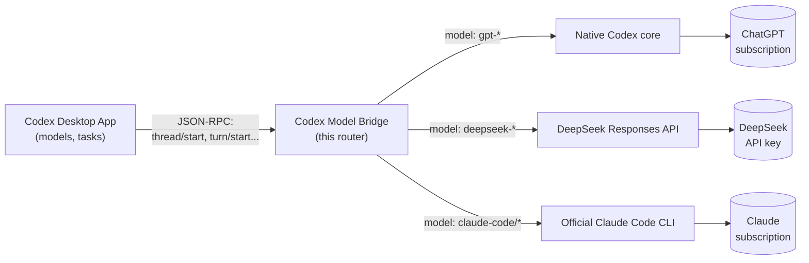

# Codex Model Bridge

[](LICENSE)
[🇷🇺 Русский](README.md)

A local adapter for the desktop **Codex** app (ChatGPT) that adds two extra
providers to a single app alongside regular OpenAI subscription tasks:
**DeepSeek via API** and **official Claude Code via a Claude subscription**.
The original app binary and its auth files are not modified — the adapter
only replaces the executable the desktop app launches for the core process.

**Status: experimental, single-user/single-machine.** Some features are only
verified by unit tests or a native simulator, not a live desktop session —
see [docs/verification.md](docs/verification.md) for details and boundaries.

## Architecture

This is not a patch or a hack of the app: the adapter is a JSON-RPC router
that stands in for the stock core-process executable and speaks the exact
same protocol the desktop already uses (`thread/start`, `turn/start`, etc.).
It only looks at the selected model to decide where to forward the request;
it never leaks anything extra to a provider, and OAuth files and the
ChatGPT/Claude subscriptions never pass through the adapter's own code.



The desktop has no idea a different provider is behind the model — it just
gets responses over the same protocol. Each provider only ever receives its
own request and its own credentials; the adapter never mixes or extracts
another provider's tokens.

## Features

- **Model menu**: besides built-in OpenAI models, a new task shows
  `DeepSeek Flash`, `DeepSeek Pro`, and several `Claude Code` variants
  (default/Opus/Fable/Sonnet/Haiku).
- **Model-selectable subagents** (`bridge_agents`): `spawn_agent`,
  `wait_agents`, `send_message`, `interrupt_agent`, `list_agents`,
  `list_models`. Without an explicit model, a subagent inherits the parent's
  model; you can also pick OpenAI, DeepSeek API, or Claude Code explicitly.
  Details and limits — [docs/subagents.md](docs/subagents.md).
- **Codex skills for DeepSeek and Claude** (`bridge_skills`): subtasks on
  external engines automatically see enabled Codex skills (project and
  plugin) and can read their instructions/resources. DeepSeek can trigger
  built-in ImageGen (via the ChatGPT subscription). Details —
  [docs/skills.md](docs/skills.md).
- **Full Claude Code integration**: streaming text, session resume across
  process restarts (via the exact session id), file read/search through
  built-in Read/Glob/Grep, Bash/Write/Edit with per-action manual approval,
  image input (5 MiB limit, matching the Anthropic API).
- **History and sidebar** for Claude threads work through the adapter's own
  SQLite registry, which augments the desktop's native metadata.

## Known Limitations

- Mobile/cloud sync does not work: the adapter only writes conversations to
  its own `routes.sqlite3`, not to the native rollout journal that cloud
  sync relies on.
- Background Bash commands are currently rejected.
- Third-party MCP servers, hooks, `CLAUDE.md`, and Claude memory are not
  loaded — the official CLI runs in `--safe-mode`.
- Only image attachments and explicit skill attachments are supported;
  plan/review/realtime and other attachment types are not.
- Not every Claude menu entry has been verified with a real request (some
  are only confirmed via the installed CLI's own listing).

## Requirements

- macOS with the desktop **Codex** app on an active ChatGPT subscription.
- Python 3.11+ (tested on 3.14).
- A DeepSeek API key for the DeepSeek route.
- The official `claude` CLI logged into a Claude subscription for the Claude
  route (`claude auth login`); no OpenAI API key is required for anything.

## Installation

```bash
git clone <this-repo-url>
cd codex-model-bridge
cp bridge.example.toml bridge.local.toml
```

Enable the providers you need in `bridge.local.toml`:

```toml
[bridge]
enable_deepseek = true
enable_claude = true
```

Then generate the local launchers (they embed the absolute path of your own
install, so they are not part of the repo and don't survive a plain copy to
another machine):

```bash
python3 -m bridge.install
python3 -m bridge.install_app
```

## Configuration

- The DeepSeek key is expected at `~/.codex/deepseek.key` (mode `0600`) by
  default; the path can be changed via `deepseek_key` in `bridge.local.toml`.
- `bridge.local.toml`, `.runtime/`, and any `*.key`/`*.sqlite*` files are
  already in `.gitignore` — **never commit them** or paste the key contents
  anywhere.
- Claude runs through the already-authenticated official CLI; the adapter
  itself never extracts or stores tokens.

## Usage

1. Fully quit Codex (⌘Q).
2. Open the generated `bin/Codex Bridge.app` (or run
   `bin/Launch Codex Bridge.command`).
3. Start a new task — the model menu will show the DeepSeek/Claude entries
   alongside the original OpenAI models.

The engine locks in after the first message; start a new task to switch
providers. To go back to stock Codex, quit the app and run the generated
`bin/Launch Standard Codex.command` — your existing tasks and files are kept.

## Development & Testing

```bash
bin/codex-bridge bridge-doctor
python3 -m bridge.launch --check
python3 -m unittest discover -s tests -v
```

The `tests/live_*.py` and `tests/native_*.py` scripts make real (and in some
cases paid/quota-consuming) requests to DeepSeek/Claude/OpenAI — run them
deliberately and explicitly; they are not part of the regular unit test run.

## Security

Never commit `bridge.local.toml`, `*.key` files, or `.runtime/` contents. If
a secret ends up committed by mistake, see [SECURITY.md](SECURITY.md) and
rotate it with the provider even after the commit is removed.

## License

[MIT](LICENSE)
