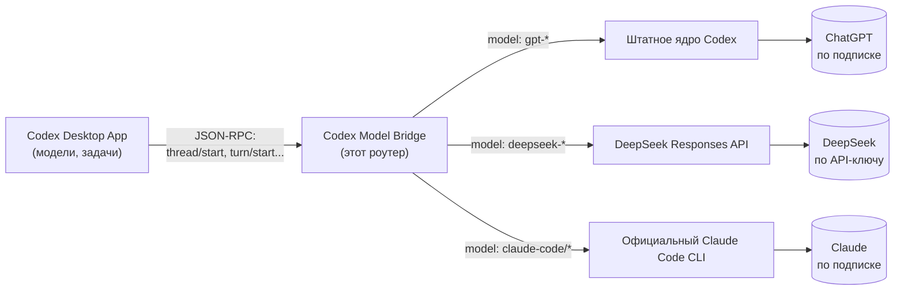

# Codex Model Bridge

[](LICENSE)
[🇬🇧 English](README.en.md)

Локальный адаптер для десктопного приложения **Codex** (ChatGPT), который в
одном приложении добавляет к обычным задачам OpenAI по подписке ещё два
провайдера: **DeepSeek по API** и **официальный Claude Code по подписке
Claude**. Оригинальный бинарник приложения и его файлы авторизации не
изменяются — адаптер подменяет только исполняемый файл, который desktop-app
запускает для core-процесса.

**Статус: экспериментальный, для одного пользователя/машины.** Часть
возможностей проверена только юнит-тестами или через нативный симулятор, не
живым десктопом — детали и границы проверки в [docs/verification.md](docs/verification.md).

## Архитектура

Это не патч и не взлом приложения: адаптер — это JSON-RPC роутер, который
подставляется вместо штатного исполняемого файла core-процесса и говорит с
десктопом ровно на том же протоколе (`thread/start`, `turn/start` и т.д.).
Он смотрит только на выбранную модель и решает, куда переслать запрос:
своему провайдеру не отдаётся ничего лишнего, а OAuth-файлы и подписка
ChatGPT/Claude вообще не проходят через код адаптера.



Десктоп не знает, что за моделью стоит другой провайдер — он просто получает
ответы по тому же протоколу. Каждый провайдер получает только свой запрос
и свои учётные данные; адаптер не смешивает и не извлекает чужие токены.

## Возможности

- **Меню моделей**: помимо встроенных моделей OpenAI, в новой задаче
  появляются `DeepSeek Flash`, `DeepSeek Pro` и несколько вариантов
  `Claude Code` (default/Opus/Fable/Sonnet/Haiku).
- **Субагенты с выбором модели** (`bridge_agents`): `spawn_agent`,
  `wait_agents`, `send_message`, `interrupt_agent`, `list_agents`,
  `list_models`. Без явной модели субагент наследует модель родителя;
  можно явно указать OpenAI, DeepSeek API или Claude Code. Подробности и
  ограничения — [docs/subagents.md](docs/subagents.md).
- **Навыки Codex у DeepSeek и Claude** (`bridge_skills`): субзадачи на
  внешних движках автоматически видят включённые навыки Codex (проектные и
  плагины) и могут читать их инструкции/ресурсы. DeepSeek может вызывать
  генерацию изображений через штатный ImageGen (по подписке ChatGPT).
  Подробности — [docs/skills.md](docs/skills.md).
- **Полноценная интеграция Claude Code**: потоковый текст, продолжение
  сессии после перезапуска процесса (по точному session id), чтение и поиск
  файлов через встроенные Read/Glob/Grep, Bash/Write/Edit с ручным
  разрешением на каждое действие, вставка изображений (лимит 5 MiB, как у
  Anthropic API).
- **История и боковая панель** для Claude-задач работают через собственный
  SQLite-реестр, который дополняет метаданные штатного ядра десктопа.

## Известные ограничения

- Синхронизация с мобильным приложением/облаком не работает: адаптер пишет
  переписку только в свой `routes.sqlite3`, а не в штатный rollout-журнал,
  который использует облачная синхронизация.
- Фоновые команды (background Bash) пока отклоняются.
- Сторонние MCP-серверы, hooks, `CLAUDE.md` и память Claude не загружаются —
  официальный CLI запускается в `--safe-mode`.
- Из вложений поддержаны изображения и явные вложения типа skill; plan/review/
  realtime и остальные типы — нет.
- Не все пункты меню Claude проверены реальными запросами (часть — только
  через список установленного CLI).

## Требования

- macOS, десктопное приложение **Codex** с активной подпиской ChatGPT.
- Python 3.11+ (проверено на 3.14).
- Для маршрута DeepSeek — ключ DeepSeek API.
- Для маршрута Claude — официальный CLI `claude`, залогиненный в подписку
  Claude (`claude auth login`); OpenAI API-ключ не требуется ни для чего.

## Установка

```bash
git clone <URL-этого-репозитория>
cd codex-model-bridge
cp bridge.example.toml bridge.local.toml
```

В `bridge.local.toml` включите нужные провайдеры:

```toml
[bridge]
enable_deepseek = true
enable_claude = true
```

Затем сгенерируйте локальные запускатели (они привязаны к абсолютному пути
именно вашей установки, поэтому не входят в репозиторий и не переносятся
между машинами простым копированием каталога):

```bash
python3 -m bridge.install
python3 -m bridge.install_app
```

## Настройка

- Ключ DeepSeek по умолчанию ожидается в `~/.codex/deepseek.key` с правами
  `0600`; путь можно изменить параметром `deepseek_key` в `bridge.local.toml`.
- `bridge.local.toml`, `.runtime/` и любые `*.key`/`*.sqlite*` файлы уже
  добавлены в `.gitignore` — **не коммитьте их** и не отправляйте содержимое
  ключа в переписку.
- Claude запускается через уже существующий вход официального CLI; сам
  адаптер токены не извлекает и не хранит.

## Использование

1. Полностью закрыть Codex (⌘Q).
2. Открыть сгенерированный `bin/Codex Bridge.app` (или запустить
   `bin/Launch Codex Bridge.command`).
3. Создать новую задачу — в меню моделей появятся записи DeepSeek/Claude
   вместе с исходными моделями OpenAI.

Движок закрепляется за задачей после первого сообщения; для перехода на
другого провайдера создайте новую задачу. Чтобы вернуться к штатному Codex —
закройте приложение и запустите сгенерированный
`bin/Launch Standard Codex.command`; ваши задачи и файлы при этом сохраняются.

## Разработка и тесты

```bash
bin/codex-bridge bridge-doctor
python3 -m bridge.launch --check
python3 -m unittest discover -s tests -v
```

Скрипты `tests/live_*.py` и `tests/native_*.py` выполняют реальные (и в
части случаев платные/квотируемые) запросы к DeepSeek/Claude/OpenAI —
запускайте их осознанно и явно, они не входят в обычный unit-прогон.

## Безопасность

Никогда не коммитьте `bridge.local.toml`, файлы `*.key` и содержимое
`.runtime/`. Если случайно закоммитили секрет — см. [SECURITY.md](SECURITY.md)
и ротируйте секрет у провайдера, даже если коммит потом удалили.

## Лицензия

[MIT](LICENSE)
